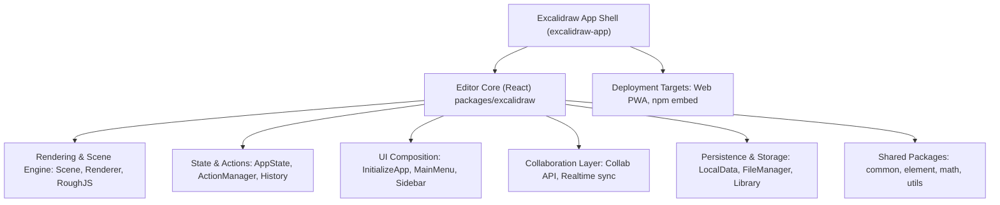

# Architecture Overview

## Key Concepts

- **Editor Core (`packages/excalidraw`)**: React component tree that renders the canvas, manages drawing logic, and exposes the public API.
- **Scene Engine**: `Scene`, `Renderer`, and RoughJS integration maintain the element graph and render it on `<canvas>`.
- **State Management**: Combination of React class component state (`App`), contexts, and Jotai stores for cross-cutting concerns (app state, collaboration, settings).
- **Action System**: `ActionManager` registers user commands (keyboard, menu). Actions resolve to `perform()` functions that mutate elements/app state consistently.
- **Collaboration Stack**: `excalidraw-app` enriches the core with WebSocket/Firebase driven syncing via `Collab` and `CollabAPI` atoms.
- **Persistence**: Local-first storage through `LocalData`, IndexedDB libraries, and remote exports (`exportToBackend`, `importFromBackend`).
- **Shared Packages**: `common`, `element`, `math`, and `utils` provide reusable geometry, serialization, analytics, and constants across the app and npm package.
- **App Shell (`excalidraw-app`)**: Vite-powered SPA that hosts the editor, orchestrates onboarding flows, theming, and PWA features.

## Data Flow Highlights

1. **User Interaction** → `ActionManager` → Scene/AppState mutation → React render.
2. **Scene Updates** → `App` reconciles elements → Renderer draws to `<canvas>`.
3. **Persistence Hooks** listen to `onChange` callbacks and write to LocalData or remote storage.
4. **Collaboration** leverages `CollabAPI` to broadcast scene deltas and fetch binary assets.
5. **Public API Consumers** interact via `ExcalidrawImperativeAPI` context, enabling embedding apps to control the editor programmatically.
