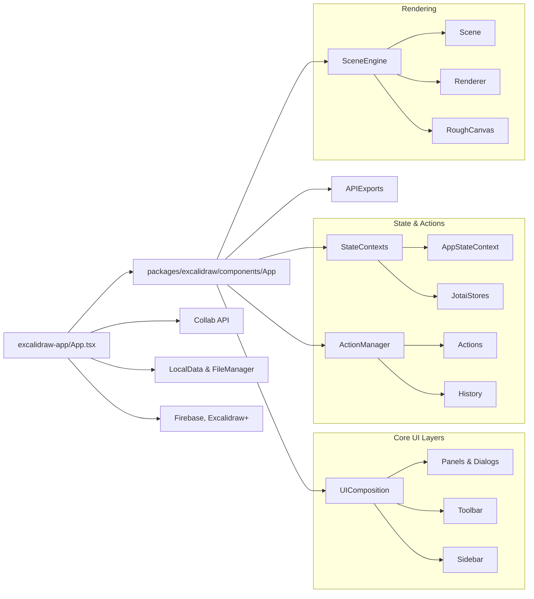

# Major Components

## Core Modules

- **AppShell (`excalidraw-app/App.tsx`)**
  - Bootstraps the editor, configures collaboration, theme, localization, and persistence hooks.
  - Hosts app-level UI (Promos, Welcome, Share dialog).

- **Editor Core (`packages/excalidraw/components/App.tsx`)**
  - React class component controlling the canvas lifecycle, action registration, and context providers.
  - Manages the `Scene`, history stack, and keyboard interactions.

- **ActionManager & Actions (`packages/excalidraw/actions`)**
  - Normalizes user commands; each action defines shortcuts, UI affordances, and `perform()` logic.
  - Integrates with analytics tracking.

- **State Contexts & Jotai Stores (`packages/excalidraw/editor-jotai.ts`)**
  - Provide hooks like `useAppStateValue` for external consumers.
  - Synchronize internal class state with functional hooks.

- **Scene Engine (`packages/excalidraw/scene`, `element`, `math`)**
  - Handles element definitions, geometry operations, hit testing, and RoughJS rendering.

- **Collaboration Layer (`excalidraw-app/collab`)**
  - `Collab` component wires WebRTC/WebSocket signaling, Firebase storage for assets, and tab sync.

- **Persistence (`excalidraw-app/data`)**
  - `LocalData` autosaves to IndexedDB / localStorage.
  - `FileManager`, `exportToBackend`, `importFromBackend` orchestrate remote storage.

- **Public API (`packages/excalidraw/index.tsx`)**
  - Exposes `<Excalidraw />` component, imperative API, and hooks (`useExcalidrawAPI`).
